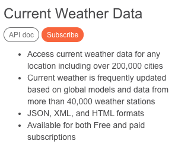
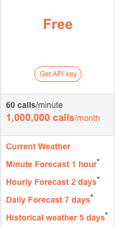

# OpenWeather API
!weather lets you get info about the weather in a city. To recieve this data, make an account at <a href="https://openweathermap.org/">OpenWeatherMap.org</a> and go to the <a href="https://openweathermap.org/api">API section</a>. Click <kbd>Subscribe</kbd> under 'Current Weather Data'.

Select the <kbd>Get API Key</kbd> under free tier.

Go to the <a href="https://openweathermap.org/api_keys">API Keys</a> tab.

 Copy your API token. You will need it later.
