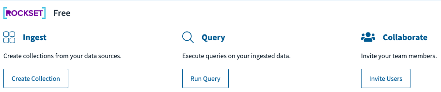
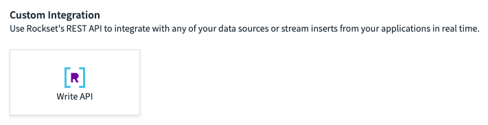
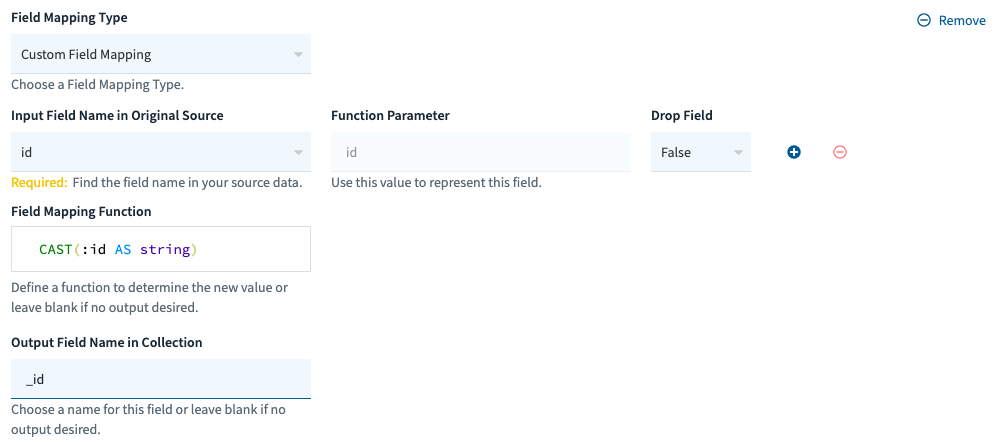
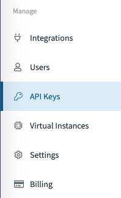

<h1>Rockset</h1>
<a href="rockset.com">Rockset</a> is a database that we will use to store user's info. In the database, we store contents for user's experinces to be personalized. One of the things we store is user's cites, so they can run !weather without typing their city. (More personaliztion features are in development). 
Start by creating an account at <a href="rockset.com">Rockset</a> on the free tier and head to your <a href="http://console.rockset.com/">Rockset console</a>. Create a new collection.

Under "Custom Integration", choose "Write API".

Name the collection "GadhaBotUsers". 
Create the following field mapping.

Hit <kbd>Create</kbd>. Now our database is setup. 
We have to create an API key to access our database. Click <kbd><a href="https://console.rockset.com/apikeys">API Keys</a> on the left sidebar.</kbd>

After creating your API key, copy it. You will need it later.
